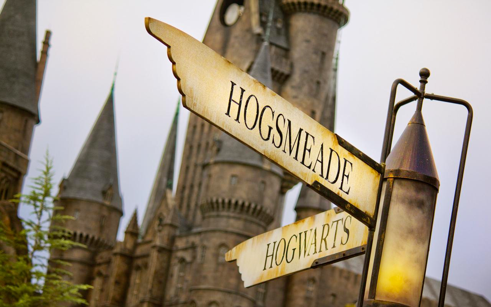

## 训练控制模型 (ControlNet)

### 原理

我们将 `latent` 的通道数从`16`提升到`32`。其中，另外16个通道用于控制模型。这些通道的值将被用于控制生成器的输出。我们将这些通道的值视为`latent`的一部分，因此我们将其与`latent`连接在一起。这样，我们就可以通过调整这些通道的值来控制生成器的输出。

### 服务器要求

- 至少需要`1`张`A100GPU`。使用`zero2`进行训练，则每张卡可以承载8个batch。
- 如果你希望全量微调模型，我们推荐使用`batchsize=128`。
- Linux操作系统以安装`deepseed`。

### 准备数据集

在这个例子汇总，我们使用 [open_pose_controlnet](https://huggingface.co/datasets/raulc0399/open_pose_controlnet) 进行微调。
你也可以使用自己的数据，这通常需要你遵循`open_pose_controlnet`数据集的格式或修改 dataloader。

**请注意**

+ 所有图像都会被resize成固定大小的图片，不支持动态分辨率。
+ 不支持动态长度的token。每个batch的token都会被pad成最大长度。

### 开始训练

1. 源代码安装 [diffusers](https://github.com/huggingface/diffusers) 并打开微调目录
```shell
git clone https://github.com/huggingface/diffusers.git
cd diffusers
pip install -e .
cd examples/cogview4-control
```

2. 配置`deepsped`环境 和 `accelerate` 环境

这里是一个示例的  `accelerate` 配置文件。使用`zero2`

```yaml
compute_environment: LOCAL_MACHINE
debug: false
deepspeed_config:
  # deepspeed_hostfile: hostfile # 如果是多机多卡训练，需要自行准备配置hostfile
  gradient_accumulation_steps: 1
  gradient_clipping: 1.0
  offload_optimizer_device: cpu
  offload_param_device: cpu
  zero3_init_flag: false
  zero_stage: 2
num_machines: 1
num_processes: 8 # 一共8台机器，如果是两台机器则要写16。
# main_process_port: 29500
# main_process_ip: 10.250.XX.XX # 如果是多机多卡训练，需要自己设置主机IP
distributed_type: DEEPSPEED
downcast_bf16: 'no'
enable_cpu_affinity: false
gpu_ids: all
machine_rank: 0
main_training_function: main
mixed_precision: bf16
rdzv_backend: static
same_network: true
tpu_env: []
tpu_use_cluster: false
tpu_use_sudo: false
use_cpu: false
```
并将这个配置文件保存为 `accelerate_ds.yaml`。

3. 运行以下命令开始训练:
```shell
accelerate launch --config_file=accelerate_ds.yaml train_control_cogview4.py \
  --pretrained_model_name_or_path="THUDM/CogView4-6B" \
  --dataset_name="raulc0399/open_pose_controlnet" \
  --output_dir="pose-control" \
  --mixed_precision="bf16" \
  --train_batch_size=1 \
  --dataloader_num_workers=16 \
  --gradient_accumulation_steps=1 \
  --gradient_checkpointing \
  --proportion_empty_prompts=0 \
  --learning_rate=5e-5 \
  --adam_weight_decay=1e-4 \
  --report_to="wandb" \
  --lr_scheduler="cosine" \
  --lr_warmup_steps=1000 \
  --checkpointing_steps=100 \
  --max_train_steps=50000 \
  --validation_steps=100 \
  --validation_image "pose.jpg" \
  --validation_prompt "two friends sitting by each other enjoying a day at the park, full hd, cinematic" \
  --offload \
  --seed="0"
```

**请注意**

- 必须使用 `bf16` 混合精度训练 或者 `fp32` 进行训练。不支持 `fp16` 和 `fp8`。
- `validation_image` 和 `validation_prompt` 需要自己准备并放在同一个目录下，例子中使用的是 `open_pose_controlnet`的第一条数据。

## 调用微调后的权重

这里假设你使用了`10000`步的结果。并假设你训练的模型的分辨率是`1024`。

### SFT

```python
from diffusers import CogView4ControlPipeline,CogView4Transformer2DModel
from controlnet_aux import CannyDetector
from diffusers.utils import load_image
import torch
transformer = CogView4Transformer2DModel.from_pretrained("pose-control/checkpoint-10000/transformer", torch_dtype=torch.bfloat16).to("cuda:0")
pipe = CogView4ControlPipeline.from_pretrained("THUDM/CogView4-6B",transformer=transformer, torch_dtype=torch.bfloat16).to("cuda:0")

prompt = "two friends sitting by each other enjoying a day at the park, full hd, cinematic"
control_image = load_image("pose.jpg")
processor = CannyDetector()
control_image = processor(
    control_image, low_threshold=50, high_threshold=200, detect_resolution=1024, image_resolution=1024
)
image = pipe(
    prompt=prompt,
    control_image=control_image,
    height=1024,
    width=1024,
    num_inference_steps=50,
    guidance_scale=3.5,
).images[0]

image.save("cogview4.png")
```

